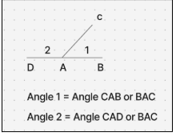

- Start from Class 6 pdf, Chapter 15 [https://ncert.nic.in/textbook.php?fegp1=5-10](https://ncert.nic.in/textbook.php?fegp1=5-10)

| x   | 2   | 3   | 4   | 5   | 6   | 7   | 8   | 9   | 10  | 11  | 12  | 13  | 14  | 15  | 16  | 17  | 18  | 19  | 20  |
| --- | --- | --- | --- | --- | --- | --- | --- | --- | --- | --- | --- | --- | --- | --- | --- | --- | --- | --- | --- |
| 1   | 2   | 3   | 4   | 5   | 6   | 7   | 8   | 9   | 10  | 11  | 12  | 13  | 14  | 15  | 16  | 17  | 18  | 19  | 20  |
| 2   | 4   | 6   | 8   | 10  | 12  | 14  | 16  | 18  | 20  | 22  | 24  | 26  | 28  | 30  | 32  | 34  | 36  | 38  | 40  |
| 3   | 6   | 9   | 12  | 15  | 18  | 21  | 24  | 27  | 30  | 33  | 36  | 39  | 42  | 45  | 48  | 51  | 54  | 57  | 60  |
| 4   | 8   | 12  | 16  | 20  | 24  | 28  | 32  | 36  | 40  | 44  | 48  | 52  | 56  | 60  | 64  | 68  | 72  | 76  | 80  |
| 5   | 10  | 15  | 20  | 25  | 30  | 35  | 40  | 45  | 50  | 55  | 60  | 65  | 70  | 75  | 80  | 85  | 90  | 95  | 100 |
| 6   | 12  | 18  | 24  | 30  | 36  | 42  | 48  | 54  | 60  | 66  | 72  | 78  | 84  | 90  | 96  | 102 | 108 | 114 | 120 |
| 7   | 14  | 21  | 28  | 35  | 42  | 49  | 56  | 63  | 70  | 77  | 84  | 91  | 98  | 105 | 112 | 119 | 126 | 133 | 140 |
| 8   | 16  | 24  | 32  | 40  | 48  | 56  | 64  | 72  | 80  | 88  | 96  | 104 | 112 | 120 | 128 | 136 | 144 | 152 | 160 |
| 9   | 18  | 27  | 36  | 45  | 54  | 63  | 72  | 81  | 90  | 99  | 108 | 117 | 126 | 135 | 144 | 153 | 162 | 171 | 180 |
| 10  | 20  | 30  | 40  | 50  | 60  | 70  | 80  | 90  | 100 | 110 | 120 | 130 | 140 | 150 | 160 | 170 | 180 | 190 | 200 |

# Geometry

## Angles

- Acute < 90
- 90 < Obtuse < 180
- 180 < Reflex < 360
- In a clock, 30 degrees in an hour, 6 degrees in a minute, 6 degrees in a second
  - In 12 hours, the hour hand covers 360 degrees, so 1 hours = 360 / 12 = 30 degrees
  - In 60 minutes, the minute hand covers 360 degrees, so 1 minute = 360 / 60 = 6 degrees
  - In 60 seconds, the seconds hand covers 360 degrees, so 1 second = 360 / 60 = 6 degrees
- Straight angle = 180
- Right angle = 90
  - Perpendicular lines: Two lines at 90 degrees to each other are called to be perpendicular to each other

## Shapes

- Triangle : 3 sides and 3 corners.
  - Equilateral Triangle : All 3 sides equal, All 3 angles equal
  - Isosceles Triangle : 2 sides equal, 2 angles equal
  - Scalene Triangle : nothing is equal
  - Right Angle Triangle : One angle is 90 degrees.
- Square - 4 equal sides, 4 right angle corners
  - Opposite sides are parallel
- Rhombus : leaning square
  - 4 equal sides, but no right angles.
  - Opposite sides are parallel
- Rectangle : all 4 right angles.
  - Opposite sides equal
  - Opposite sides are parallel
- Parallelogram : leaning rectangle
  - Opposite sides equal
  - Opposite sides are parallel
  - But no right angle
- Pentagon : 5 sides, 5 corners
  - Regular Pentagon
    - Equal 5 sides
    - All angles are equal = 360 / 5 = 72 degrees
- Hexagon : 6 sides, 6 corners
  - Regular Hexagon
    - Equal 6 sides
    - All angles are equal = 360 / 6 = 60 degrees
- WHAT DOES "REGULAR" MEAN?
  - A shape is called REGULAR when:
    - ✅ All sides are equal
    - ✅ All angles are equal
- Septagon : 7 sides, 7 corners
- Octagon : 8 sides, 8 corners
- Nonagon : 9 sides, 9 corners
- Decagon : 10 sides, 10 corners

# Measurements

## Length

- Millimetre (mm)
- Centimetre (cm)
  - 1 cm = 10 mm
- Decimetre (dm)
  - 1 dm = 10 cm
- Metre (m)
  - 1 m = 10 dm
  - 1 m = 100 cm
- Decametre (dam)
  - 1 dam = 10 m
- Hectometre (hm)
  - 1hm = 10m
- Kilometre (km)
  - 1 km = 1000 m

## Weight

- Milligram (mg)
- Gram (g)
  - 1g = 1000 mg
- Kilogram (kg)
  - 1kg = 1000 g

## Capacity

- Millilitre (ml)
- Litre (L)
  - 1L = 1000ml

## Quantity

- Hundred : 10 power 2, 100
- Thousand : 10 power 3, 1000
- Million : 10 power 6, 1000000
- Billion : 10 power 9, 1000000000
- Trillion : 10 power 12, 1000000000000

# Numbers

## Natural Numbers

1, 2, 3, ...

Start from 1.

Counting numbers.

## Whole Numbers

0, 1, 2, 3, ...

Start from 0.

Whole = Natural + 0.

## Integers

..., -3, -2, -1, 0, 1, 2, 3 ...

Include negatives + 0 + positives.

## Positive / Negative

Positive: > 0

Negative: < 0

0 is neither positive nor negative.

## Prime / Composite

Defined only for positive integers.

Prime: Exactly 2 factors → 1 & itself (2, 3, 5, 7, 11...)

Composite: > 2 factors (4, 6, 8, 9, 10...)

1 → neither prime nor composite (only 1 factor)

0 → neither prime nor composite (Not prime because any number is a factor of 0, Not composite because prime / composite is only defined for positive integers)

2 → only even prime.

## Even / Odd

Even: ends in 0, 2, 4, 6, 8 (divisible by 2)

Odd: ends in 1, 3, 5, 7, 9

# Fractions

A fraction shows a part of a whole.

¾ is a fraction, 3 is Numerator and 4 is Denominator

## Types of Fractions

1. Proper Fraction
  a. Numerator < Denominator
   b. Value is between 0 and 1
   c. 4 / 7
2. Improper Fractions
  a. Numerator > Denominator
   b. Value is more than 1
   c. 94 / 76
3. Mixed Fraction
  a. Combination of a whole number + a fraction.
   b. Another way to write improper fraction
   c. 9 / 4 = 2 ¼
4. Like Fractions (same denominator)
  a. 2 / 7, 5 / 7
5. Unlike Fractions (different denominator)
  a. 2 / 3, 1 / 6
6. Equivalent Fractions
  a. Fractions that look different but have the same value.
   b. One fraction, multiply numerator and denominator with a same number
   c. 1 / 2, 2 / 4, 3 / 6

## Converting Between Fractions

1. Improper to Mixed
  a. Divide, Q R / D or Quotient Remainder / Divisor  
   b. 11 / 4 = 2 3 / 4
2. Mixed = Improper
  a. Multiply, ( Q * D + R ) / D
   b. 2 3 / 4 = (4 * 2 + 3) / 4 = 11 / 4

## Comparing Fractions

1. Like fractions
  a. Compare numerators
   b. 5 / 9 > 3 / 9
2. Unlike fractions
  a. Compare numerators, after making denominator same
   b. 2 / 3 and 3 / 4
      i. LCM of 3 and 4 is 12
      ii. Make denominator 12 for both
      iii. 2 / 3 = 8 / 12 and 3 / 4 = 9 / 12
      iv. Now denominator is same, so compare numerators
      v. 2 / 3 < 3 / 4

## Addition of Fractions

1. Like Fractions
  a. Just add numerators.
   b. 3 / 4 + 2 / 4 = 5 / 4 = 1 1 / 4
2. Unlike Fractions
  a. Add numerators after making denominators same
   b. 1 / 4 + 1 / 6
      i. LCM of 4 and 6 is 12
      ii. 1 / 4 = 3 / 12 and 1 / 6 = 2 / 12
      iii. So 1 / 4 + 1 / 6 = 5 / 12
3. Similar for Subtraction too

## Converting Fraction to Decimals

1. Proper Fractions
  a. Just divide
   b. ¾ = 0.75, 1 / 5 = 0.2
2. Improper Fractions
  a. Just divide the proper part and add it to the whole part.
   b. 9 / 4 = 2 1 / 4 = 2 + 1 / 4 = 2.25

## Converting Decimals Back to Fractions

1. As many digits after the decimal, that many number of zeroes
  a. 0.75 = 75 / 100
   b. 0.5643 = 5643 / 10000

## Simplest Form of Fraction

1. If numerator and denominator can be divided by the same number, divide it.
  a. 75 / 100 = 3 / 4 (divide NR and DR by 25).
   b. 12 / 100 = 3 / 25 (divide NR and DR by 4).
   c. 6 / 12 = 1 / 2

## Multiplication of Fractions

1. Multiply numerator × numerator
2. Multiply denominator × denominator
3. 2 / 3 * 4 / 5 = 2 * 4 / 3 * 5 = 8 / 15

## Division of Fractions

1. Multiply by the reciprocal of the divisor
2. 2 / 3 ÷ 4 / 5 = 2 / 3 * 5 / 4 = 10 / 12 = 5 / 6
3. 2 / 7 * 8 / 10 = 2 / 7 * 10 / 8 = 20 / 56 = 5 / 14
